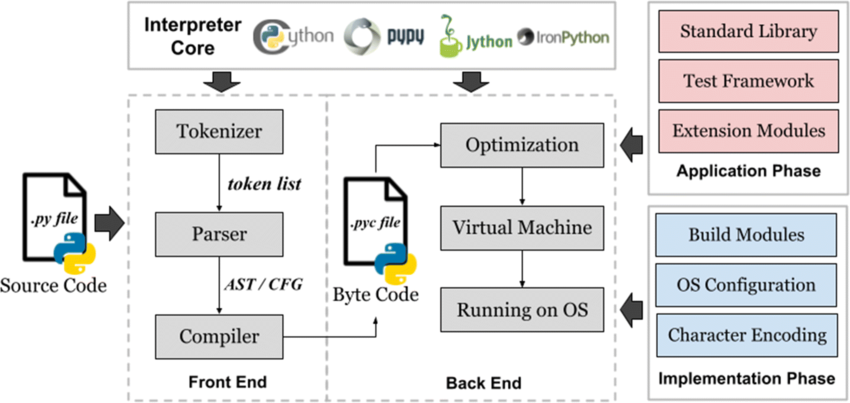

# Performance Analysis of Modular and Mojo

This documentation is a part of [Reasearch Paper](./Research-Paper/Performance%20and%20Metrics%20Analysis%20Between%20Python3%20via%20Mojo.pdf) published which provides a performance analysis of Modular and Mojo, which are stated to support high-performance speed. The analysis was done using three famous data structure-based algorithms: Linear Search, Insertion Sort, and Bubble Sort. Recursion-based algorithms were not tested due to Python's fixed maximum recursion depth.

DOI : https://doi.org/10.1109/ICSCSS60660.2024.10625342 \
**_Please make sure to cite the research article_**

## Table of Contents

- [Introduction](#introduction)
  - [Python Architecture](#python-architecture)
  - [Architectural Breakdown](#architectural-breakdown)
    - [Java Bytecode vs Python Bytecode](#java-bytecode-vs-python-bytecode)
  - [MOJO](#mojo)
- [Avoiding Maximum Recursion Depth in Python](#avoiding-maximum-recursion-depth-in-python)
- [Architectures Considered for Testing](#architectures-considered-for-testing)
  - [Google Colab (a)](#google-colab-a)
  - [Windows 10 (b)](#windows-10-b)
  - [Modular Playground (c)](#modular-playground-c)
  - [RAM Specifications for Amazon EC2 C6i Instances](#ram-specifications-for-amazon-ec2-c6i-instances)
  - [Operating Systems and Programming Languages](#operating-systems-and-programming-languages)
- [Algorithm Implementation and Testing](#algorithm-implementation-and-testing)
  - [Performance Metrics](#performance-metrics)

# Introduction

## Python Architecture

Python is a high-level programming language that has been developed since the late 1980s by Guido van Rossum. It was designed to replace the ABC programming language, which worked with the Amoeba operating system. The first version of Python was released in 1994 under version 1.0, followed by version 2.0 in 2000, and version 3.0 in 2008. The Python interpreter, called CPython, is written in the C programming language and works behind the scenes.

## Architectural Breakdown

The CPython implementation, the most widely used, employs a multi-stage compiler architecture. Here's a breakdown of its key components:

1. **Tokenizer**: This initial stage dissects the source code, splitting it into fundamental units called tokens. These tokens represent keywords (like `def`, `if`), identifiers (variable names), operators (`+`, `-`), and delimiters (parentheses, commas).

2. **Parser**: The parser takes the token stream and constructs an Abstract Syntax Tree (AST). The AST serves as a hierarchical representation of the program's structure, capturing the relationships between code elements.

3. **Bytecode Generation**: Traversing the AST, this stage translates it into bytecode, a low-level instruction set specifically designed for the Python Virtual Machine (PVM). Each bytecode instruction corresponds to an operation the PVM can execute.

### Java Bytecode vs Python Bytecode

Java and Python are programming languages that use a bytecode as an intermediate representation for their programs. There are several differences between Java bytecode and Python bytecode:

- **Platform Independence**: Java bytecode is platform-independent, allowing it to run seamlessly on various platforms as long as a compatible JVM is present. On the other hand, Python bytecode lacks inherent platform independence, and its execution relies on the Python Virtual Machine (PVM), which is not a platform-independent abstraction layer.
- **Optimization Potential**: Java bytecode offers greater optimization potential due to its Just-In-Time (JIT) compiler, which dynamically translates frequently executed bytecode sections into machine code during runtime. However, Python bytecode has less extensive optimization opportunities and is generally considered faster.
- **Development Workflow**: Java bytecode involves a two-stage compilation process, requiring stricter type checking, while Python bytecode generates bytecode at runtime, offering a streamlined development workflow but potentially causing errors.

4. **Optimization**: Certain Python implementations incorporate optimization passes at this stage. These passes may analyze the bytecode to identify redundancies or inefficiencies, potentially improving the code’s performance.

5. **Bytecode Emission**: Finally, the optimized bytecode is written to a `.pyc` file. This file serves as an intermediate representation and can be reused for subsequent executions, provided the source code hasn’t changed.

## MOJO

Mojo, a multi-paradigm programming language, was created by Chris Lattner to bridge the gap between research and production stages of AI development. It offers syntax familiarity, unparalleled performance, Python interoperability, parallel processing, and model extensibility. Mojo borrows heavily from Python's syntax, providing a smoother transition from research to production. It leverages the MLIR compiler infrastructure, allowing for the translation of Mojo code into highly optimized machine code.

Mojo also allows for Python interoperability, enabling developers to leverage existing Python libraries within their code. Furthermore, Mojo allows for the modification and extension of existing AI models, providing a powerful tool for advanced AI development. Mojo uses the LLVM compiler infrastructure project for exceptional performance, but instead uses MLIR (Multi-Level Intermediate Representation) as a bridge between Mojo's source code and the LLVM toolchain.

MLIR offers language independence, rich optimization opportunities, and extensibility, allowing for efficient machine code tailored to specific hardware and domain-specific optimizations relevant to AI applications, enabling further performance enhancements.

# Avoiding Maximum Recursion Depth in Python

Python has a fixed maximum recursion depth, meaning there's a limit to how many times a function can call itself recursively before an error occurs. To avoid reaching the maximum recursion depth in Python:

- Optimize recursive functions.
- Ensure they have a base case that terminates the recursion.
- Customize the recursion depth limit in Python using the `sys` module.

# Architectures Considered for Testing

The architectures considered for the task are as follows:

## Google Colab (a)

- **CPU Model:** x86_64
- **Operating System:** Linux-6.1.58+-x86_64-with-glibc2.35
- **Physical Cores:** 1
- **Logical Cores:** 2
- **RAM:** 12.67 GB
- **Architecture:** 64bit

## Windows 10 (b)

- **CPU Model:** AMD64 Family 23 Model 113 Stepping 0, AuthenticAMD
- **Operating System:** Windows-10-10.0.19045-SP0
- **Physical Cores:** 6
- **Logical Cores:** 12
- **RAM:** 15.93 GB
- **Architecture:** 64bit

## Modular Playground (c)

- **OS:** Linux
- **CPU:** Cascadelake
- **Architecture:** x86_64-unknown-linux-gnu
- **Physical Cores:** 4
- **Logical Cores:** 8
- **CPU Features:** sse4, avx, avx2, avx512f, avx512_vnni

The information of the Modular Playground has been obtained from the official documentation where it states:

> "With 3rd Generation Intel Xeon Scalable processors powering them, Amazon EC2 C6i instances offer up to 15% better pricing performance than C5 instances for a variety of applications. With a RAM to virtual CPU ratio of 2:1, they support up to 128 virtual instances per instance, which is an increase of 33% when compared to C5 instances. Examples of these instances include video encoding, ad serving, high speed computing, distributed analytics, batch processing, and multiplayer gaming that require high compute power. Besides being ideal for low-latency, high-speed applications, they also feature local NVMe-based SSD block-level storage. In terms of cost per TB, the C6id instances are 56% cheaper than C5d instances and would have up to 138% more storage capacity per virtual CPU. The C6in versions provide for two times the packet performance of the C5n instances and up to 200 Gbps of network capacity. Besides, they have the ability to deliver 400K I/O operations per second (IOPS) and up to 100 Gbps of Amazon Elastic Block Store (EBS) performance which is perfect for applications with a huge network demand."

## RAM Specifications for Amazon EC2 C6i Instances

Based on the provided text, the RAM specifications for Amazon EC2 C6i instances are as follows:

- **vCPU to Memory Ratio:** 2:1
- **Maximum Virtual CPUs:** 128 (which is an increment of 33% in comparison to C5 instances)

This implies that for every two vCPUs, there is a corresponding unit of memory. For C6i instances with up to 128 vCPUs, the memory allocation is up to 64 units (128 vCPU ÷ 2 memory units per vCPU = 64 units of memory).

## Operating Systems and Programming Languages

The performance of programming languages varies with different variations of operating systems. Some operating systems are more optimized for certain programming languages, leading to better performance and efficiency.

# Algorithm Implementation and Testing

The snippets of the algorithms and the implementation of the codes in MOJO in the playground are as follows. The list creation was done with 10,000 data points, and the test analysis involved creating random 10,000 data points and then implementing the algorithm as a whole.

## Performance Metrics

| Algorithm      | Colab          | Windows        | PlayGround      |
| -------------- | -------------- | -------------- | --------------- |
| Bubble Sort    | 17.0 mins      | 10.45 mins     | 2.26132006 secs |
| Insertion Sort | 7.50 mins      | 4.49 mins      | 21.0106325 secs |
| Linear Search  | 0.011804580 ms | 0.015014410 ms | 0.80044052 secs |

The performance metrics displayed for each algorithm in all the environments show a wide range of execution times.

- **Bubble Sort O(n²):** Runs more quickly in PlayGround compared to Colab and Windows, possibly due to different resource allocation and optimization approaches.
- **Insertion Sort O(n²):** Windows and PlayGround are faster than Colab in terms of execution time.
- **Linear Search O(n):** Operates very fast in Colab and Windows but is a little slower in PlayGround.

These variations demonstrate the influence of system resources, optimization strategies, and environmental configurations on algorithm efficiency, pointing out that these factors should be taken into consideration when comparing algorithms in various contexts.
